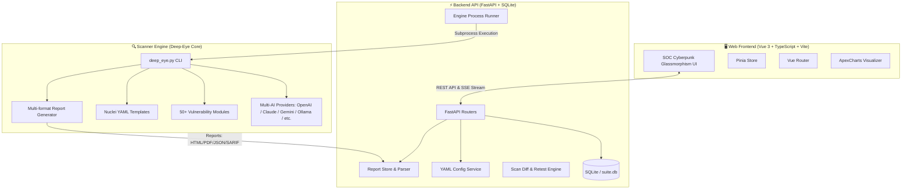

# 🛡️ DeepEye Scanner Suite

<p align="center">
  
</p>

<p align="center">
  <strong>Platform Keamanan Siber & Dynamic Application Security Testing (DAST) Berbasis AI</strong>
</p>

<p align="center">
  
  
  
  
  
  
  
</p>

> ### 🔗 Asal-usul Proyek
> Proyek **DeepEye Scanner Suite** ini adalah **pengembangan lebih lanjut dari repositori [`zakirkun/deep-eye`](https://github.com/zakirkun/deep-eye)**. Repositori induk (`deep-eye`) menyediakan *scanner engine* DAST berbasis CLI yang powerful, namun membutuhkan pemahaman teknis untuk menjalankannya. Suite ini **menambahkan lapisan UI modern (Web GUI + REST API)** di atas engine tersebut agar **lebih mudah digunakan oleh semua kalangan** — mulai dari pengguna awam yang belum begitu paham keamanan siber hingga *penetration tester* dan tim AppSec tingkat advance — tanpa harus berinteraksi langsung dengan *command line*.

---

## 📖 Daftar Isi

1. [Tentang DeepEye Scanner Suite](#-tentang-deepeye-scanner-suite)
2. [Arsitektur Sistem](#-arsitektur-sistem)
3. [Fitur Utama](#-fitur-utama)
4. [Tech Stack](#-tech-stack)
5. [Struktur Direktori](#-struktur-direktori)
6. [Instalasi & Menjalankan Proyek](#-instalasi--menjalankan-proyek)
   - [Prasyarat](#prasyarat)
   - [Quick Start (Dev Mode)](#quick-start-mode-pengembangan)
   - [Instalasi Manual Backend](#instalasi-manual-backend)
   - [Instalasi Manual Frontend](#instalasi-manual-frontend)
7. [Panduan REST API](#-panduan-rest-api)
8. [Tampilan Antarmuka (Web GUI)](#-tampilan-antarmuka-web-gui)
9. [Pengujian & Kualitas Kode](#-pengujian--kualitas-kode)
10. [Konfigurasi SonarQube](#-konfigurasi-sonarqube)
11. [Lisensi & Kontribusi](#-lisensi--kontribusi)

---

## 🎯 Tentang DeepEye Scanner Suite

**DeepEye Scanner Suite** adalah ekosistem pengujian penetrasi web dan pemindaian kerentanan otomatis modern yang dibangun sebagai **pengembangan lanjutan dari [`zakirkun/deep-eye`](https://github.com/zakirkun/deep-eye)**. Proyek induk `deep-eye` berfokus pada *scanner engine* CLI yang powerful untuk DAST, sementara Suite ini menambahkan **Backend REST API berperforma tinggi (FastAPI)** dan **Web GUI bertema SOC / Cyberpunk futuristik (Vue 3 + Tailwind CSS)** di atas engine tersebut.

Tujuannya adalah membuat kemampuan *scanning* cerdas dari DeepEye Engine — termasuk orkestrasi Multi-LLM dan 50+ modul kerentanan — **dapat diakses dengan mudah oleh semua kalangan**, baik pengguna awam yang belum begitu paham keamanan siber maupun *penetration tester* advance, melalui antarmuka visual yang intuitif, wizard pemindaian terpandu, monitoring real-time, dan pelaporan standar industri (SARIF, PDF, HTML, JSON) serta perbandingan hasil scan (*scan diffing & retest*).

---

## 🏗️ Arsitektur Sistem

DeepEye Scanner Suite dibangun di atas 3 pilar utama:



---

## 🚀 Fitur Utama

### 1. 🤖 Multi-AI Intelligence & Failover
- Orkestrasi ke **11+ AI Provider**: OpenAI (GPT-4o), Anthropic Claude, Google Gemini, Ollama (Local LLM), Groq, Mistral, OpenRouter, xAI Grok, LiteLLM, LM Studio, dan OrcaRouter.
- Pembuatan payload pintar sadar konteks (*context-aware payloads* berdasarkan WAF & fingerprint teknologi).
- AI False Positive Filtering & Triage otomatis.
- AI Executive Summary & rekomendasi remediasi.

### 2. 🛡️ 50+ Modul Kerentanan & Engine Fleksibel
- Mendeteksi OWASP Top 10: SQL Injection, XSS, SSRF, IDOR, Broken JWT, GraphQL Introspection/Abuse, CORS misconfiguration, Secret leaks, Prototype Pollution, Deserialization, dll.
- Dukungan ingest spesifikasi **OpenAPI / Swagger** untuk pemindaian endpoint API yang presisi.
- Kompatibilitas template format **Nuclei YAML**.
- Mekanisme bypass WAF dan deteksi CAPTCHA (Cloudflare Turnstile, reCAPTCHA, hCaptcha).

### 3. 📊 Dasbor Keamanan & GUI SOC
- Tema **Dark Cyberpunk Glassmorphism** yang terstandarisasi dengan CSS custom properties.
- Dasbor analitik interaktif: Donut chart keparahan kerentanan, tren pemindaian, metrik total target.
- **Wizard Pemindaian 5 Langkah**: Konfigurasi target, kedalaman crawl, thread, otentikasi header/cookies, hingga custom AI scope.
- **Live Terminal & Real-Time Monitoring**: Streaming log subprocess scan langsung ke web browser.
- **Vulnerability Explorer**: Filter berdasarkan severity (Critical, High, Medium, Low, Info), parameter, payload, dan verifikasi False Positive.
- **Scan Comparison (Diff & Retest)**: Membandingkan baseline scan dengan scan terbaru untuk menemukan regresi kerentanan baru (*new findings*) atau kerentanan yang telah diperbaiki (*fixed*).

### 4. 📑 Format Pelaporan Lengkap
- Ekspor laporan dalam berbagai format standar kepatuhan:
  - **HTML**: Laporan interaktif mandiri.
  - **PDF**: Format eksekutif siap cetak.
  - **JSON / SARIF**: Integrasi CI/CD & GitHub Security.
  - **JUnit XML**: Integrasi pipeline test runner.
  - **CSV / XLSX**: Analisis spreadsheet & data audit.
- Pemetaan standar kepatuhan: **PCI-DSS v4, SOC 2, ISO 27001:2022**.

---

## 💻 Tech Stack

| Komponen | Teknologi | Keterangan |
|---|---|---|
| **Frontend Framework** | [Vue.js 3](https://vuejs.org/) (Composition API) | UI reaktif modern |
| **Language (UI)** | [TypeScript 5.5](https://www.typescriptlang.org/) | Type-safe frontend code |
| **Build Tool** | [Vite 5](https://vitejs.dev/) & [pnpm](https://pnpm.io/) | Fast bundling & HMR |
| **Styling** | [Tailwind CSS 3.4](https://tailwindcss.com/) | Utilitas styling dengan custom design tokens |
| **State Management** | [Pinia 2.2](https://pinia.vuejs.org/) | Reaktif & modular global state |
| **Visualisasi Data** | [ApexCharts](https://apexcharts.com/) + Vue3-ApexCharts | Chart donat & bar visualizer |
| **Backend API** | [FastAPI](https://fastapi.tiangolo.com/) & [Uvicorn](https://www.uvicorn.org/) | RESTful API berbasis asynchronous Python |
| **Database** | [SQLite](https://www.sqlite.org/) | Database lokal ringan untuk menyimpan job & finding |
| **Scanner Engine** | Python 3.12+ / Deep-Eye Core | Mesin pemindai DAST bertenaga AI |
| **Testing** | Pytest, Vitest, Playwright | 100% test coverage pada backend dan frontend |

---

## 📁 Struktur Direktori

```text
DeepEye-scanner-suite/
├── api/                        # Backend REST API (FastAPI)
│   ├── database.py             # SQLite setup, koneksi, migrasi tabel
│   ├── main.py                 # Entry point FastAPI app & middleware CORS
│   ├── pyproject.toml          # Konfigurasi Pytest & Coverage Python
│   ├── routers/                # Endpoint router API
│   │   ├── config.py           # Endpoint konfigurasi global
│   │   ├── maintenance.py      # Endpoint vacuum & maintenance database
│   │   ├── providers.py        # Endpoint pengujian AI providers
│   │   ├── reports.py          # Endpoint download/preview laporan
│   │   ├── scans.py            # Endpoint orkestrasi scan & log streaming
│   │   └── templates.py        # Endpoint manajemen scan preset/template
│   ├── services/               # Logika bisnis backend
│   │   ├── config_service.py   # Manipulasi file YAML konfigurasi
│   │   ├── engine_runner.py    # Runner eksekusi subprocess CLI deep-eye
│   │   ├── report_store.py     # Parser & repository file laporan
│   │   └── scan_compare.py     # Logika komparasi dan kalkulasi scan diff
│   └── tests/                  # Unit test backend (100% Line Coverage)
│
├── scanner/                    # Submodul Core Scanner Engine
│   └── deep-eye/               # CLI deep_eye.py, modul AI, dan plugin checks
│
├── web/                        # Frontend Web GUI (Vue 3 + Vite)
│   ├── design/                 # Design system tokens, komponen, dan dokumentasi SOC
│   ├── e2e/                    # Pengujian End-to-End dengan Playwright
│   ├── src/
│   │   ├── api/                # API client & HTTP wrappers
│   │   ├── router/             # Konfigurasi Vue Router
│   │   ├── stores/             # Pinia state stores (scans, config, findings)
│   │   └── views/              # Halaman web (Dashboard, NewScan, ScanLive, Findings, dll.)
│   ├── package.json            # Dependensi frontend & script pnpm
│   ├── tailwind.config.js      # Konfigurasi tema Tailwind & warna SOC
│   └── vitest.config.ts        # Konfigurasi Vitest unit testing
│
├── data/                       # Penyimpanan database lokal SQLite (suite.db)
├── plans/                      # Dokumen spesifikasi teknis dan rencana implementasi
├── reports/                    # Direktori output laporan hasil pemindaian
├── scripts/
│   └── dev.sh                  # Skrip otomatisasi menjalankan backend + frontend
├── sonar-project.properties    # Konfigurasi audit kualitas kode SonarQube
└── README.md                   # Dokumentasi utama proyek
```

---

## ⚙️ Instalasi & Menjalankan Proyek

### Prasyarat

Pastikan sistem Anda telah terpasang:
- **Python 3.12+**
- **Node.js 18+** & **pnpm 9+**
- Git

### Quick Start (Mode Pengembangan)

Cara termudah dan tercepat untuk menjalankan seluruh suite:

```bash
# Berikan izin eksekusi jika diperlukan
chmod +x scripts/dev.sh

# Jalankan backend dan frontend secara bersamaan
./scripts/dev.sh
```

Akses layanan melalui browser:
- 🌐 **Web Frontend**: [http://localhost:5173](http://localhost:5173)
- ⚡ **Backend API**: [http://localhost:8000/api/health](http://localhost:8000/api/health)
- 📚 **Swagger Docs API**: [http://localhost:8000/docs](http://localhost:8000/docs)

---

### Instalasi Manual Backend

1. Buat dan aktifkan virtual environment Python:
   ```bash
   python3 -m venv .venv
   source .venv/bin/activate  # Untuk Linux/macOS
   # .venv\Scripts\activate   # Untuk Windows
   ```

2. Instal dependensi backend & scanner:
   ```bash
   pip install -r scanner/deep-eye/requirements.txt
   pip install fastapi uvicorn[standard] pyyaml pydantic
   pip install -r api/requirements-dev.txt
   ```

3. Jalankan server FastAPI:
   ```bash
   uvicorn api.main:app --reload --port 8000
   ```

---

### Instalasi Manual Frontend

1. Pindah ke direktori `web`:
   ```bash
   cd web
   ```

2. Pasang dependensi menggunakan `pnpm`:
   ```bash
   pnpm install
   ```

3. Jalankan Vite development server:
   ```bash
   pnpm dev
   ```

4. Build untuk produksi:
   ```bash
   pnpm build
   ```

---

## 🔌 Panduan REST API

FastAPI menyediakan dokumentasi interaktif bawaan di `/docs` (Swagger UI) dan `/redoc`. Berikut ringkasan endpoint utama:

### 1. Manajemen Pemindaian (`/api/scans`)
- `POST /api/scans` — Memulai pemindaian baru.
- `GET /api/scans` — Mendapatkan daftar semua riwayat job pemindaian.
- `GET /api/scans/{id}` — Mendapatkan detail status job tertentu.
- `POST /api/scans/{id}/stop` — Menghentikan proses pemindaian yang sedang aktif.
- `GET /api/scans/{id}/logs` — Mendapatkan stream/teks log proses pemindaian.
- `GET /api/scans/{id}/findings` — Mengambil daftar kerentanan yang terdeteksi pada job tersebut.
- `POST /api/scans/compare` — Membandingkan dua hasil pemindaian (*diffing*).

### 2. Konfigurasi & AI Providers (`/api/config`)
- `GET /api/config` — Mengambil konfigurasi aktif (`config.yaml`).
- `PUT /api/config` — Memperbarui pengaturan scanner & konfigurasi AI.
- `POST /api/config/providers/test` — Melakukan uji konektivitas API key AI provider.

### 3. Laporan Hasil Scan (`/api/reports`)
- `GET /api/reports` — Daftar semua file artefak laporan yang tersedia.
- `GET /api/reports/{filename}/download` — Mengunduh file laporan (PDF, HTML, SARIF, JSON, dll.).
- `GET /api/reports/{filename}/preview` — Melihat preview konten laporan HTML secara langsung.

### 4. Template & Preset Pemindaian (`/api/templates`)
- `GET /api/templates` — Daftar template pemindaian (e.g. Quick Scan, Full Audit, OWASP Top 10).
- `POST /api/templates` — Membuat template baru.
- `PUT /api/templates/{id}` — Memperbarui template.
- `DELETE /api/templates/{id}` — Menghapus template.

### 5. Pemeliharaan Sistem (`/api/maintenance`)
- `POST /api/maintenance/vacuum` — Mengoptimalkan ukuran dan index database SQLite.
- `POST /api/maintenance/clear-logs` — Membersihkan file log lama.
- `GET /api/maintenance/stats` — Statistik penggunaan disk, database, dan total job.

---

## 🎨 Tampilan Antarmuka (Web GUI)

Web GUI DeepEye dibangun dengan filosofi desain **Security Operations Center (SOC)** modern:

- **Dashboard**: Panel ringkasan status keamanan real-time, grafik keparahan kerentanan, dan pemindai aktif.
- **New Scan Wizard**: Antarmuka 5 tahap untuk memandu pembuatan pemindaian dari konfigurasi target dasar hingga parameter lanjutan.
- **Scan Live Console**: Terminal web interaktif dengan streaming output langsung dari engine scanner.
- **Findings Explorer**: Tabel kerentanan dengan filter dinamis, detail request/response payload, skor keparahan, serta ringkasan analisis AI.
- **Scan Compare**: Visualisasi perbedaan dua pemindaian (kerentanan baru, fixed, dan persistent).
- **Settings Panel**: Pusat pengaturan lengkap untuk mengelola kunci API provider AI, konfigurasi proxy, batas kedalaman crawling, thread, dan integrasi notifikasi.

---

## 🧪 Pengujian & Kualitas Kode

DeepEye Scanner Suite memiliki cakupan pengujian komprehensif (Unit, Integration, dan E2E) untuk memastikan keandalan sistem secara menyeluruh:

### Menjalankan Unit Test Backend
```bash
# Menjalankan Pytest dengan laporan Coverage
pytest api/tests --cov=api --cov-report=term-missing --cov-report=xml:api/coverage.xml
```

### Menjalankan Unit Test Frontend
```bash
cd web
# Menjalankan Vitest dengan coverage V8
pnpm test:coverage
```

### Menjalankan Pengujian End-to-End (E2E)
```bash
cd web
# Menjalankan Playwright test suite
pnpm test:e2e
```

---

## 🔍 Konfigurasi SonarQube

Proyek ini telah dikonfigurasi dengan [`sonar-project.properties`](file:///Users/dwihendroajipranolo/Herd/DeepEye-scanner-suite/sonar-project.properties) untuk inspeksi kode otomatis, keamanan, dan pemantauan *Quality Gate* (ambang batas coverage minimum 80%):

- **Python Coverage**: Laporan `api/coverage.xml`
- **TypeScript/JavaScript Coverage**: Laporan `web/coverage/lcov.info`
- **Exclusions**: Submodul scanner external, file build (`dist/`, `node_modules/`, `.venv/`), dan artefak cache.

Untuk menjalankan pemindaian lokal dengan SonarScanner CLI:
```bash
sonar-scanner \
  -Dsonar.host.url=http://localhost:9000 \
  -Dsonar.token=<YOUR_SONAR_TOKEN>
```

---

## 📄 Lisensi, Kredit & Kontribusi

Proyek ini dilisensikan di bawah lisensi [MIT License](LICENSE).

### Kredit
- **Engine Induk:** [`zakirkun/deep-eye`](https://github.com/zakirkun/deep-eye) — *core scanner engine* DAST & kumpulan modul kerentanan.
- **DeepEye Scanner Suite:** Pengembangan lanjutan oleh kontributor suite ini dengan penambahan **FastAPI Backend**, **Vue 3 Web GUI**, manajemen scan, *live log streaming*, *diff/retest*, dan pelaporan multi-format agar dapat digunakan oleh semua kalangan (pemula hingga advance).

### Disclaimer
> ⚠️ **Pemberitahuan Keamanan**: DeepEye Scanner Suite dirancang secara eksklusif untuk tujuan pengujian penetrasi resmi, audit keamanan berizin, penelitian akademis, dan penguatan pertahanan aplikasi web. Penggunaan alat ini pada target tanpa izin tertulis dari pemilik sistem adalah tindakan ilegal. Penulis dan kontributor tidak bertanggung jawab atas segala bentuk penyalahgunaan atau kerusakan yang diakibatkan oleh perangkat lunak ini.
